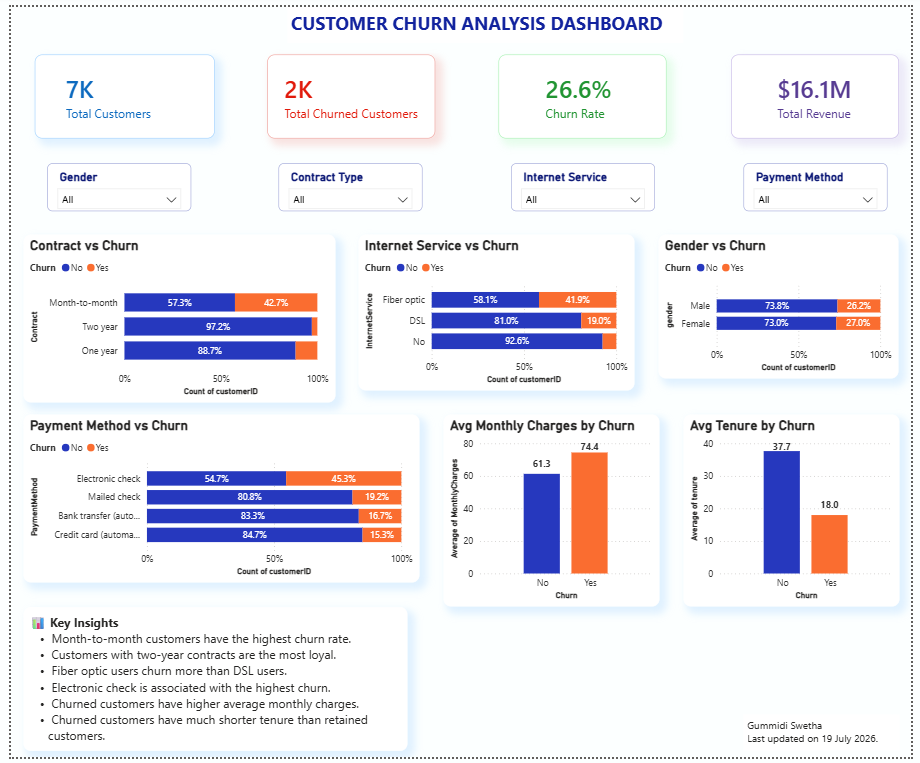
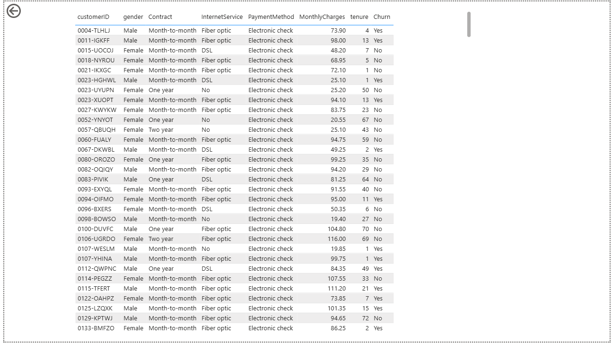
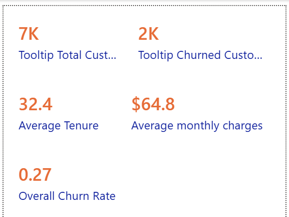
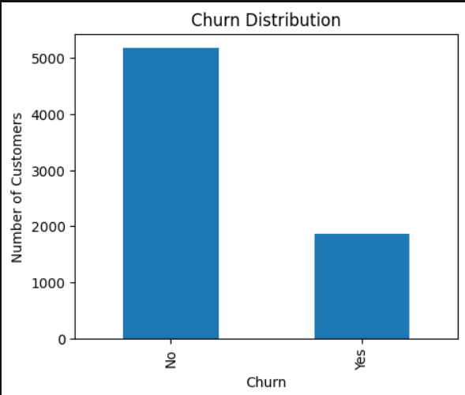
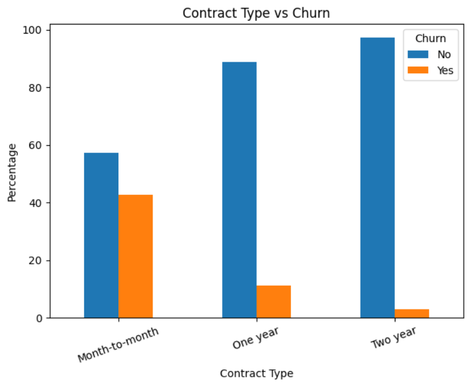
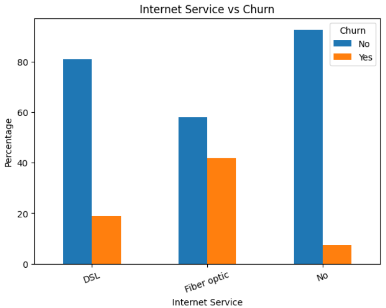
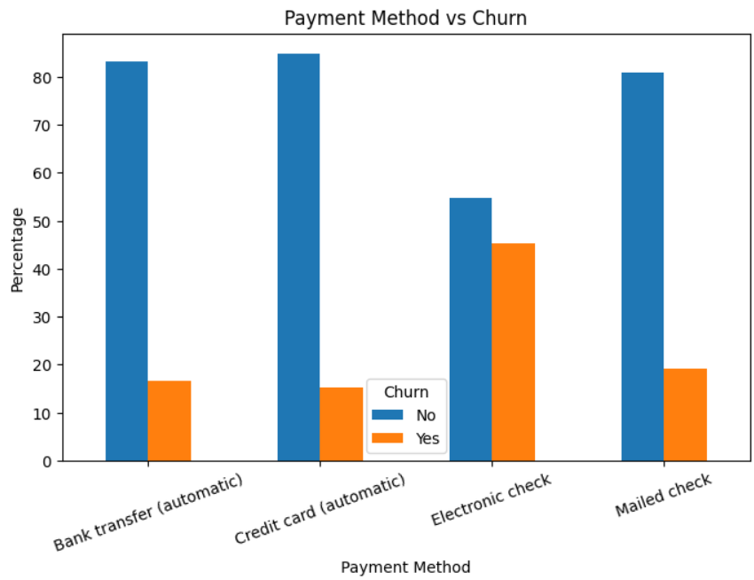
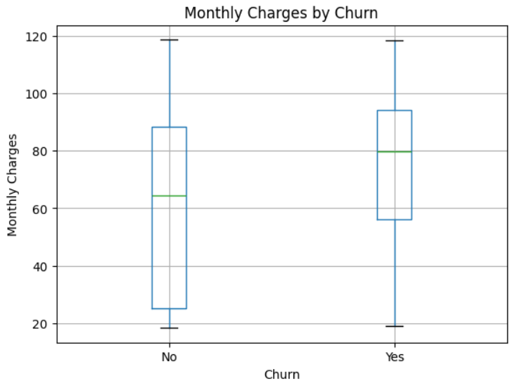
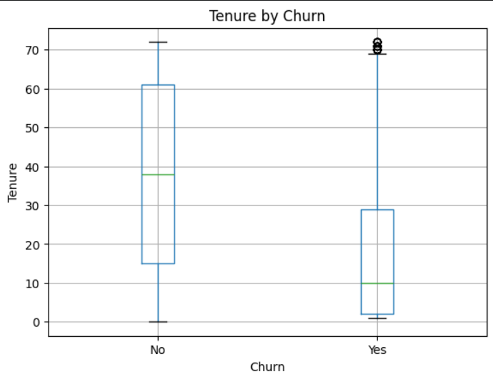

# 📊 Customer Churn Analysis

An end-to-end Customer Churn Analysis project that identifies the factors influencing customer churn using **Python, SQL, and Power BI**. The project includes data cleaning, exploratory data analysis, SQL analysis, and an interactive Power BI dashboard for business insights.

---

## 🚀 Project Overview

Customer churn is one of the biggest challenges for subscription-based businesses. This project analyzes customer behavior to understand why customers leave and provides insights that can help improve customer retention.

---

## 🎯 Objectives

- Analyze customer churn patterns.
- Identify key factors affecting churn.
- Build an interactive Power BI dashboard.
- Perform exploratory data analysis using Python.
- Write SQL queries to answer business questions.

---

## 🛠️ Tools & Technologies

- Python
- Pandas
- NumPy
- Matplotlib
- SQL (MySQL)
- Power BI
- Excel

---

## 📂 Dataset

- **Rows:** 7,043
- **Columns:** 21

Dataset includes:

- Customer demographics
- Contract type
- Internet service
- Payment method
- Monthly charges
- Tenure
- Churn status

---

# 📈 Power BI Dashboard

## Dashboard Overview



---

## Customer Details (Drillthrough)



---

## Tooltip Analysis



---

# 🐍 Python Visualizations

## Churn Distribution



---

## Contract Type vs Churn



---

## Internet Service vs Churn



---

## Payment Method vs Churn



---

## Monthly Charges by Churn



---

## Tenure by Churn



---

# 📊 Dashboard KPIs

- Total Customers
- Churned Customers
- Churn Rate
- Total Revenue
- Average Monthly Charges
- Average Customer Tenure

---

# 💡 Key Business Insights

- Customers with **Month-to-month contracts** have the highest churn rate.
- Customers using **Fiber Optic Internet** churn more frequently.
- **Electronic Check** users show the highest churn.
- Churned customers have **higher monthly charges**.
- Customers with **shorter tenure** are more likely to churn.
- **Two-year contracts** have the lowest churn rate.

---

# 📁 Project Structure


```text
customer-churn-analysis/
│
├── Images/
│   ├── Dashboard.png
│   ├── Drillthrough.png
│   ├── Tooltip.png
│   ├── churn_distribution.png
│   ├── contract_type_vs_churn.png
│   ├── internet_service_vs_churn.png
│   ├── monthly_charges_by_churn.png
│   ├── payment_method_vs_churn.png
│   └── tenure_by_churn.png
│
├── churn.csv
├── customer_churn_analysis.ipynb
├── customer_churn_dashboard.pbix
└── README.md
```

---

# 🎯 Skills Demonstrated

- Data Cleaning
- Exploratory Data Analysis (EDA)
- SQL Querying
- Data Visualization
- Power BI Dashboard Development
- KPI Development
- Business Intelligence
- Data Storytelling

---

## 👩‍💻 Author

**Gummidi Swetha**

**Aspiring Data Analyst | Python | SQL | Power BI | Excel**

 Excel
